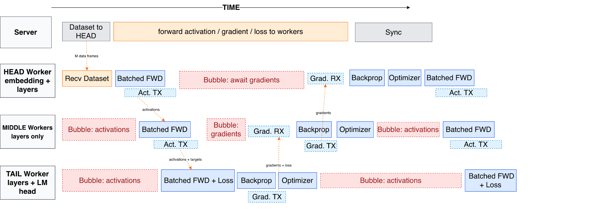

# Centurion — project blog (GitHub Pages)

A single self-contained `index.html` (inline CSS, no build step). Drop in two
images/video and it's done.

## Deploy to GitHub Pages

1. Create a new repo on GitHub, e.g. `centurion-blog` (public).
2. Push these files to the `main` branch:
   ```bash
   cd C:\Users\ZachH\centurion-site
   git init
   git add .
   git commit -m "Centurion project blog"
   git branch -M main
   git remote add origin https://github.com/<you>/centurion-blog.git
   git push -u origin main
   ```
3. On GitHub: **Settings → Pages → Source: Deploy from a branch → `main` / `(root)` → Save.**
4. Wait ~1 minute. Your site is live at
   `https://<you>.github.io/centurion-blog/`

## Add the visuals (placeholders are marked in the page)

- **Pipeline timeline figure** — export the forward/backward/bubble chart from
  your slides as `pipeline.png`, put it in this folder, then replace the
  `<div class="video-ph" id="pipeline-fig">…</div>` block with:
  ```html
  
  ```

- **Demo video** — either:
  - YouTube: replace the `id="demo-video"` box with
    ```html
    <iframe width="100%" style="aspect-ratio:16/9;border:0;border-radius:12px"
      src="https://www.youtube.com/embed/VIDEO_ID" allowfullscreen></iframe>
    ```
  - or a local file: drop `demo.mp4` here and use
    ```html
    <video src="demo.mp4" controls style="width:100%;border-radius:12px"></video>
    ```

## Things to double-check before publishing

- The "~3,250 tok/s ≈ RTX 4080" claim from the talk is **not** on the page on
  purpose — it's risky if questioned. Add it back only with the exact
  batch/seq/precision you measured the GPU at.
- Confirm the per-worker demo numbers (layers, MB, RTT) match your final run;
  they're transcribed from the orchestrator screenshot.
- Optional: add a real loss-curve image to the Results section — it's the most
  direct "it actually learned" evidence.
